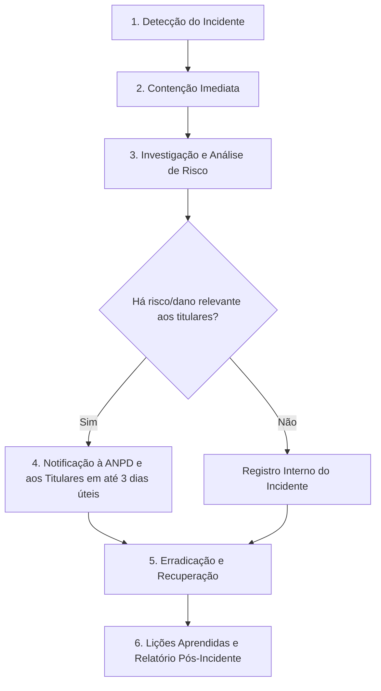

# Governança de Dados e Conformidade LGPD

> **Centro Visão Optometria**  
> Documento Oficial de Governança, Inventário de Dados Pessoais, Trilha de Auditoria e Resposta a Incidentes  
> **Legislação Aplicável:** Lei Geral de Proteção de Dados Pessoais (Lei nº 13.709/2018 — LGPD), Lei do Prontuário Eletrônico (Lei nº 13.787/2018) e normativas sanitárias vigentes.

---

## 1. Introdução e Propósito

Este documento formaliza a política e as diretrizes de conformidade com a **Lei Geral de Proteção de Dados Pessoais (LGPD - Lei nº 13.709/2018)** aplicadas à plataforma e aos serviços clínicos e operacionais do **Centro Visão Optometria**.

Como clínica especializada em serviços optométricos e de saúde visual, o sistema trata dados pessoais e **dados pessoais sensíveis referentes à saúde dos pacientes**, exigindo salvaguardas técnicas, administrativas e organizacionais reforçadas para garantir a confidencialidade, integridade, disponibilidade e privacidade dessas informações.

---

## 2. Inventário e Mapeamento de Dados Pessoais (Data Mapping)

O ciclo de vida dos dados na plataforma compreende a coleta, processamento, armazenamento, compartilhamento restrito e guarda regulatória. Os dados pessoais tratados no sistema são categorizados a seguir:

### 2.1. Dados Pessoais Comuns (Art. 5º, I da LGPD)
Coletados no cadastro de pacientes, funcionários, usuários e controle de agendamentos.

| Categoria de Dado | Campos no Sistema | Finalidade Primária | Acesso Permitido |
|---|---|---|---|
| **Identificação Civil** | Nome completo, CPF, RG, Data de Nascimento, Sexo | Identificação inequívoca do paciente e emissão de documentos clínicos/fiscais | Recepcionistas, Optometristas, Administradores |
| **Contato** | Telefone, Celular (WhatsApp), E-mail | Confirmação de consultas, lembretes de retorno, envio de receitas e avisos | Recepcionistas, Optometristas, Administradores |
| **Localização / Endereço** | Logradouro, Número, Bairro, Cidade, Estado, CEP | Faturamento, localização do paciente e estatísticas demográficas | Recepcionistas, Administradores |
| **Credenciais e Acesso** | Login/Username, Senha (hash PBKDF2), Perfil | Autenticação, controle de autorização e trilha de auditoria | Sistema interno, Administradores (sem visualização de senha) |

### 2.2. Dados Pessoais Sensíveis de Saúde (Art. 5º, II da LGPD)
Dados essenciais à prestação do serviço clínico de optometria e cuidados visuais.

| Categoria de Dado Sensível | Campos / Estruturas no Sistema | Finalidade Primária | Acesso Permitido |
|---|---|---|---|
| **Anamnese Clínica** | Queixa principal, histórico oftalmológico, patologias prévias, uso de medicamentos, histórico familiar | Diagnóstico optométrico e avaliação clínica integral | Optometristas (restrito a atendimento) |
| **Avaliação Visual / Exames** | Acuidade visual (com/sem correção), refração estática/dinâmica, ceratometria, tonometria, motilidade ocular, biomicroscopia | Determinação de ametropias, prescrição óptica e diagnóstico funcional | Optometristas |
| **Prescrições Ópticas** | Esférico, Cilíndrico, Eixo, Adição, Prisma, DNP, Tipo de lente recomendada | Prescrição de óculos e lentes de contato corretivas | Optometristas, Paciente (impressão) |
| **Documentos Clínicos** | Atestados, laudos, declarações de comparecimento, encaminhamentos | Emissão formal de documentos comprobatórios e referenciamentos | Optometristas |

---

## 3. Bases Legais de Tratamento

O tratamento de dados pessoais no Centro Visão Optometria é rigorosamente sustentado pelas bases legais da LGPD:

### 3.1. Tutela da Saúde (Art. 7º, VIII e Art. 11, II, "f" da LGPD)
- **Aplicação:** Coleta e processamento de anamneses, acuidade visual, refração, laudos e prescrições de lentes.
- **Justificativa:** Procedimento realizado exclusivamente no âmbito da prestação de serviços de assistência à saúde e atenção visual por profissionais capacitados e autorizados.

### 3.2. Cumprimento de Obrigação Legal ou Regulatória (Art. 7º, II e Art. 11, II, "a" da LGPD)
- **Aplicação:** Manutenção do histórico clínico de consultas e prontuários eletrônicos de atendimento; guarda de notas e registros fiscais.
- **Fundamentação Legal:** Lei Federal nº 13.787/2018 (guarda de prontuários por prazo mínimo de 20 anos), legislações tributárias e sanitárias.

### 3.3. Execução de Contrato e Procedimentos Preliminares (Art. 7º, V da LGPD)
- **Aplicação:** Agendamentos de consultas, emissão de comprovantes de pagamento e gestão da agenda de atendimentos solicitados pelo próprio titular.

### 3.4. Legítimo Interesse (Art. 7º, IX da LGPD)
- **Aplicação:** Registro de logs de segurança técnica (endereço IP, user-agent, correlation ID) para prevenção a fraudes, rastreamento de acessos indevidos e proteção dos ativos digitais.

---

## 4. Trilha de Auditoria (Audit Trail)

Para atender aos princípios da **Segurança (Art. 6º, VII)** e **Responsabilização e Prestação de Contas (Art. 6º, X)**, a API implementa uma trilha de auditoria automatizada e imutável.

### 4.1. Estrutura da Tabela `AUDITORIA_LOGS`

A tabela é provisionada automaticamente via `PortalORM` no início da aplicação:

| Campo | Tipo Firebird | Descrição |
|---|---|---|
| `AUD_CODIGO` | `INTEGER NOT NULL PRIMARY KEY` | Identificador único sequencial do evento de auditoria |
| `AUD_DATAHORA` | `VARCHAR(30) NOT NULL` | Timestamp exato no formato ISO `yyyy-mm-dd hh:nn:ss` |
| `AUD_USUARIO_ID` | `INTEGER` | ID do usuário autenticado no sistema |
| `AUD_USUARIO_LOGIN` | `VARCHAR(50)` | Login/Username do operador responsável pela ação |
| `AUD_IP_ORIGEM` | `VARCHAR(50)` | Endereço IP do cliente requisitante |
| `AUD_CORRELATION_ID` | `VARCHAR(50)` | Identificador UUID da requisição HTTP (`X-Correlation-Id`) |
| `AUD_TIPO_OPERACAO` | `VARCHAR(20) NOT NULL` | Operação executada: `CREATE`, `READ`, `UPDATE`, `DELETE`, `PRINT` |
| `AUD_RECURSO` | `VARCHAR(50) NOT NULL` | Entidade afetada: `PACIENTES`, `CONSULTA`, `ANAMNESE`, `PRESCRICAO`, `USUARIOS` |
| `AUD_RECURSO_ID` | `INTEGER` | Identificador primário do registro consultado ou alterado |
| `AUD_DETALHES` | `VARCHAR(500)` | Descrição sucinta da ação (sem expor conteúdo clínico sensível) |

### 4.2. Eventos Críticos Auditados

1. **Acesso ao Prontuário (`READ` em `PACIENTES`):** Rastreia visualização de prontuários individuais por profissionais ou recepção.
2. **Cadastro e Atualização (`CREATE` / `UPDATE` em `PACIENTES`):** Registra inclusão e modificações cadastrais.
3. **Inativação de Paciente (`DELETE` em `PACIENTES`):** Registra a desativação lógica do titular no sistema.
4. **Gravação Clínica (`UPDATE` em `ANAMNESE` e `PRESCRICAO`):** Registra a edição e inserção de exames e laudos visuais.
5. **Impressão e Emissão de Documentos (`PRINT` em `CONSULTA`):** Registra a geração e impressão de receitas, atestados e laudos.
6. **Gestão de Acessos (`CREATE` / `UPDATE` em `USUARIOS`):** Registra a criação de usuários e redefinição administrativa de senhas.

---

## 5. Política de Retenção e Descarte de Dados

### 5.1. Prazos de Retenção

| Tipo de Registro | Prazo Mínimo de Retenção | Fundamento |
|---|---|---|
| **Prontuários e Exames Clínicos** | 20 (vinte) anos a partir do último atendimento | Lei Federal nº 13.787/2018, Art. 6º |
| **Trilha de Auditoria (`AUDITORIA_LOGS`)** | 20 (vinte) anos (acompanha o ciclo do prontuário) | Princípio da Responsabilização e Defesa Jurídica |
| **Registros Fiscais / Financeiros** | 5 (cinco) anos após a emissão | Código Tributário Nacional (CTN) |
| **Logs Técnicos de Servidor / Console** | 6 (seis) meses | Marco Civil da Internet (Lei nº 12.965/2014, Art. 15) |

### 5.2. Mecanismo de Exclusão Lógica (*Soft Delete*)
Para garantir a preservação do histórico de saúde exigido por lei e evitar a destruição ilícita de prontuários:
- O sistema adota **exclusão lógica** (`ATIVO = 0` / `PAC_ATIVO = 0`).
- A exclusão física (`DELETE FROM PACIENTES`) é terminantemente proibida no código da aplicação para preservar a integridade do prontuário médico-optométrico.

---

## 6. Processo de Resposta a Incidentes de Segurança

Caso ocorra qualquer incidente de segurança envolvendo dados pessoais (ex.: acesso não autorizado, vazamento acidental, indisponibilidade prolongada ou adulteração de dados), o procedimento padrão deve ser seguido imediatamente:

### Etapas Operacionais:
1. **Detecção e Notificação:** Qualquer membro da equipe que suspeitar ou identificar um incidente deve notificar o Responsável Técnico e o Encarregado (DPO).
2. **Contenção:** Isolar os sistemas afetados, revogar tokens JWT, bloquear credenciais comprometidas e suspender temporariamente conexões suspeitas.
3. **Investigação:** Avaliar logs de auditoria (`AUDITORIA_LOGS`), logs de correlação (`X-Correlation-Id`) e analisar a natureza dos dados atingidos (comuns vs. sensíveis de saúde) e o número de titulares impactados.
4. **Comunicação à ANPD e Titulares:** Nos termos do Art. 48 da LGPD, havendo risco ou dano relevante aos titulares, o DPO emitirá comunicação formal contendo:
   - Descrição da natureza dos dados pessoais afetados;
   - Informações sobre os titulares envolvidos;
   - Medidas técnicas e de segurança utilizadas para a proteção dos dados;
   - Riscos relacionados ao incidente;
   - Medidas que foram ou serão adotadas para reverter ou mitigar os prejuízos.
5. **Erradicação e Recuperação:** Eliminar a causa raiz (correção de código, alteração de segredos/senhas) e restaurar serviços a partir de backups seguros.
6. **Lições Aprendidas:** Atualizar o checklist de segurança (`docs/SEGURANCA.md`) e reforçar treinamentos e controles preventivos.

---

## 7. Canal do Titular e Exercício de Direitos (Art. 18 da LGPD)

Os pacientes e colaboradores (titulares de dados) podem exercer seus direitos através do Canal de Atendimento do Titular:

- **E-mail de Contato / DPO:** `privacidade@centrovisao.local` (ou canal oficial indicado pela clínica)
- **Prazo de Resposta:** Confirmação simplificada imediata; declaração clara e completa em até 15 (quinze) dias.

### Direitos Assegurados e Limitações Regulatórias:
1. **Confirmação e Acesso aos Dados:** O paciente pode solicitar cópia integral do seu prontuário clínico e histórico de prescrições.
2. **Correção de Dados Incompletos ou Inexatos:** Retificação de telefones, endereços ou grafias incorretas de identificação civil.
3. **Eliminação de Dados:**
   - *Limitação Legal Importante:* Em virtude da base legal da **Tutela da Saúde** e da **Obrigação Legal de Guarda de Prontuários (Art. 16, I da LGPD e Lei 13.787/2018)**, pedidos de exclusão de dados clínicos e prontuários antes do prazo regulatório de 20 anos serão indeferidos fundamentadamente por força de lei.
4. **Portabilidade:** Fornecimento do histórico clínico e prescrições em formato eletrônico legível (PDF / JSON estruturado).
5. **Informação sobre Compartilhamento:** Esclarecimento de que os dados clínicos são de acesso restrito e não são comercializados ou compartilhados com terceiros, exceto laboratórios ópticos mediante solicitação/concordância do paciente para confecção de lentes.

---

## 8. Responsabilidades e Papéis

- **Controlador:** Centro Visão Optometria (Pessoa Jurídica prestadora do serviço).
- **Operadores:** Desenvolvedores e provedores de infraestrutura que processam dados sob instruções do Controlador.
- **Encarregado pelo Tratamento de Dados (DPO):** Responsável por atuar como canal de comunicação entre a clínica, os pacientes titulares e a Autoridade Nacional de Proteção de Dados (ANPD).
- **Equipe Clínica e Administrativa:** Obrigada a cumprir o sigilo profissional, manter senhas individuais confidenciais e nunca compartilhar credenciais de acesso ao sistema.

---

## 9. Histórico de Revisão do Documento

| Versão | Data | Autor / Responsável | Descrição da Alteração |
|---|---|---|---|
| 1.0 | 2026-08-26 | Gemini 3.7 Flash | Criação do documento formal de governança LGPD, inventário de dados e diretrizes de auditoria (SEC-10). |
